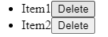

## Components:
Todo Application icin 2 adet component tanimlanmistir.
TodoForm.js, TodoList.js

<b> TodoForm.js </b>

```javascript
import React, { useState } from "react";
```
React ve useState modulleri import edilmistir. useState kullanimi ile uygulamada kullanilacak degisken tanimlanir. useState hook'u kullanilarak tanimlanan bir degiskene ulasilabilir veya degeri guncellenebilir.

Asagida value adinda bir state degiskeni tanimlanmistir. value ismi ile degerine ulasilabilir, setValue cagirildiginda icindeki parametreyi value'ye atar.
```javascript
const TodoForm = ({ addTodo }) => {
    // useState hooku kullanilarak bir state degiskeni ve , guncellemek icin fonksiyion olustur
    const [value, setValue] = useState("");

    const handleSubmit = (e) => {
        e.preventDefault();
        if (!value) return;
        addTodo(value);
        setValue("");
    };

    return (
        <form onSubmit={handleSubmit}>
            <input
                type="text"
                // input alanindaki deger value degiskenine baglanir.
                value={value}
                // onChange event handler ile bu deger guncellenir, ve metin her degistiginde value degiskeni guncellenir.
                onChange={(e) => setValue(e.target.value)}
                placeholder="Add a new todo..."
            />
            <button type="submit">Add</button>
        </form>
    );
};

export default TodoForm;
```
Asagidaki kod parcasinda value degiskeni dogrudan kullanilabilir. Ancak return kisminda geri dondurulen veri html oldugu icin javascript kodlari {} icerisinde yazilmalidir.
```javascript
const handleSubmit = (e) => {
        e.preventDefault();
        if (!value) return;
        addTodo(value);
        setValue("");
    };
``` 
Bu sebeple asagidaki value atamasi {} icerisinde cagrilmistir.
```javascript
return (
        <form onSubmit={handleSubmit}>
            <input
                type="text"
                value={value}
                onChange={(e) => setValue(e.target.value)}
                ...
``` 

<b> TodoList.js </b>

TodoList.js dosyasinda TodoList adinda bir react bileseni olusturulur. Bu bilesen todos ve deleteTodo adinda iki adet prop kabul eder.

```javascript
import React from "react";

const TodoList = ({ todos, deleteTodo }) => {
    return (
        <ul>
            {
            todos.map((todo, index) => (
                // key parametresi, React'te liste ogelerini render ederken
                // benzersiz olarak tanimasini ve guncellemelerini saglamasi icindir
                <li key={index}>
                    {todo}
                    <button onClick={() => deleteTodo(index)}>Delete</button>
                </li>
            ))}
        </ul>
    );
};

export default TodoList;
```

todos propunun bir dizi olmasi gerekmektedir. Bu parametre gonderimi App.js icerisinden saglanmistir. deleteTodo propu da bir parametre alan bir fonksiyondur. Bu parametrelerin saglanmasi ve deleteTodo fonksiyonunun icerigi App.js icerisinde yapilmistir.

```javascript
//App.js
const App = () => {
  
  const [todos, setTodos] = useState([]);
    ...
  const deleteTodo = (index) => {
    ...
    ...
  };

  return (
    <div>
      ..
      ..
      <TodoList todos={todos} deleteTodo={deleteTodo} />
    </div>
  );
};
```

todos map ile todos dizisinde donguye girilir ve her bir todo ogesi icin JSX ogesi olusturulur.
Bu ogeler, listelenen gorevleri temsil eden li ogeleridir.

```javascript
todos.map((todo, index) => (
                // key parametresi, React'te liste ogelerini render ederken
                // benzersiz olarak tanimasini ve guncellemelerini saglamasi icindir
                <li key={index}>
                    {todo}
                    <button onClick={() => deleteTodo(index)}>Delete</button>
                </li>
            ))
```

Bu sayede her bir todo icin todo ve delete button'i eklenir.


<b> App.js </b>

Sonrasinda App.js icerisinde kullanilacak componentler ve moduller import edilir.

```javascript
import React, { useState } from "react";
import TodoForm from "./components/TodoForm";
import TodoList from "./components/TodoList";
```

App adinda bir const tanimlanir ve icerisinde todos degiskeni setTodos fonksiyonunu iceren bir durum degiskeni tanimlanir. todos mevcut yapilacaklar listesini temsil eder, setTodos ise todos state'ini guncellemek icin kullanilan bir fonksiyondur.

Bu fonksiyon todos state'i guncellendiginde React uygulamasina bu degisikligi bildirir ve bilesenin yeniden render edilmesini saglar.

addTodo ve deleteTodo fonksiyonlarinin burada tanimlanmasinin sebebi, bu fonksiyonlarin todos state'ini guncellemesi ve guncelleme isleminin App componentinin sorumlulugunda olmasidir.


```javascript
const App = () => {

  const [todos, setTodos] = useState([]);

  const addTodo = (text) => {
    // ...todos , todos dizisinin tum elemanlarini yeni bir diziye yayar(spread).
    // setTodos ile todos dizisinin tum elemanlarini yeni bir diziye kopyalar,
    // sonra text degiskenini bu kopyalanan dizinin sonuna ekler.
    setTodos([...todos, text]);
  };

  const deleteTodo = (index) => {
    const newTodos = [...todos];
    newTodos.splice(index, 1);
    setTodos(newTodos);
  };

  return (
    <div>
      <h1>Todo List</h1>
      <TodoForm addTodo={addTodo} />
      <TodoList todos={todos} deleteTodo={deleteTodo} />
    </div>
  );
};

export default App;
```

<b> index.js </b>

index.js icerisinde App.js componentinde olusturulan const degeri cagirilir.

```javascript
import React from 'react';
import ReactDOM from 'react-dom';
import App from './App';

ReactDOM.render(
  //  <React.StrictMode> geliştirme sırasında potansiyel sorunları tespit etmek icin kullanilir. Canliya alinirken kaldirilmalidir.
  <React.StrictMode>
    <App />
  </React.StrictMode>,
  document.getElementById("root")
)
```

document.getElementById("root") olmasinin sebeni public/index.html dosyasinda root adinda bir container olmasidir.

```html
<body>
    <noscript>You need to enable JavaScript to run this app.</noscript>
    <div id="root"></div>
```

# Version 2 : Uygulama Yapisinda Guncellemeler, ve yeni ozellikler

TodoItem componenti eklenerek todo itemlerinin yonetilmesi kolaylastirilabilir.

<b> TodoItem.js </b>

```javascript
import React from "react";

const TodoItem = ( {todo, deleteTodo, completeTodo }) => {
    
    const handleDelete = () => {
        deleteTodo();
      };
    
    const handleComplete = () => {
        completeTodo();
    }
    return (
        <li>
            <span>
                {todo.text}
            </span>
            {todo.status === "incomplete" && (
                <button onClick={handleComplete}>Mark as Completed</button>
            )}
            <button onClick={handleDelete}>Delete</button>
        </li>
    );
};

export default TodoItem;
```

TodoItem componenti 3 adet props almaktadir. todo, item'in kendisini temsil eder. deleteTodo ve completeTodo fonksiyondur.

Icerisinde tanimlanan handleDelete() islevi ile component icerisinde yer alan Delete butonunun onClick islemi prop ile yonetilir. Ayni sekilde handleComplete islevi ile de component icerisindeki Mark as Completed butonunun onClick event'i yonetilir. todo nesnesinin status'u incomplete ise Mark as Completed butonu gosterilir. Aksi takdirde bu todo nesnesi Completed Todo List yer altinda aliyor demektir ve Mark as Completed butonu saklanir.

```javascript
    // ..
    {todo.status === "incomplete" && (
        <button onClick={handleComplete}>Mark as Completed</button>
    )}
    <button onClick={handleDelete}>Delete</button>
```

TodoItem componenti eklendikten sonra TodoList componentinde de degisiklikler yapilmistir.

<b> TodoList.js </b>

```javascript
import React from "react";
import TodoItem from "./TodoItem";

const TodoList = ({ todos, deleteTodo, completeTodo }) => {
    return (
        <ul>
            {
            todos.map((todo, index) => (
            <TodoItem
                key={index}
                todo={todo}
                deleteTodo={() => deleteTodo(index)}
                completeTodo={() => completeTodo(index)}
            />
            ))}
        </ul>
    );
};

export default TodoList;
```

TodoList componentindeki li elementlerinin yerine TodoItem componenti yerlestirilmistir.

```javascript
    // Eski versiyon
     <li key={index}>
        {todo}
        <button onClick={() => deleteTodo(index)}>Delete</button>
    </li>
```
Ardindan App.js dosyasinda degisiklikler yapilmistir.

<b> App.js </b>

```javascript
import React, { useState } from "react";
import TodoForm from "./components/TodoForm";
import TodoList from "./components/TodoList";
import CompletedTodoList from "./components/CompletedTodoList";


const App = () => {

  const [todos, setTodos] = useState([]);

  const [completedTodos, setCompletedTodos] = useState([]);

  const addTodo = (text) => {
    const newTodo = { text, status: "incomplete" };
    setTodos([...todos, newTodo]);
  };

  const deleteTodo = (index) => {
    const newTodos = [...todos];
    newTodos.splice(index, 1);
    setTodos(newTodos);
  };

  const deleteCompletedTodo = (index) => {
    const newComTodos = [...completedTodos];
    newComTodos.splice(index, 1);
    setCompletedTodos(newComTodos);
  }

  const completeTodo = (index) => {
    const updatedTodos = [...todos];
    updatedTodos[index].status = "completed";
    setCompletedTodos([...completedTodos, updatedTodos[index]]);
    deleteTodo(index);
  };

  return (
    <div>
      <h1>Todo List</h1>
      <TodoForm addTodo={addTodo} />
      <TodoList todos={todos} deleteTodo={deleteTodo} completeTodo={completeTodo} />
      <h1>Completed Todo List</h1>
      <TodoList todos={completedTodos} deleteTodo={deleteCompletedTodo} /> 
    </div>
  );
};

export default App;
```

completedTodos' lari kontrol etmek icin useState kullanilmistir. addTodo islevinin icerisinde newTodo tanimi yapilirken todo elementlerinin yeni bir ozellik olan status ozelligi de default olarak incomplete olarak tanimlanmistir.

Yapilan guncellemeler ile deleteCompletedTodo ve completeTodo islevleri de eklenmistir.
deleteCompletedTodo islevi deleteTodo ile ayni islemi yapmaktadir. Sadece islemler completedTodos listesi uzerinde yapilmaktadir.

completeTodo islevi ile, ilgili todonun statusu completed olarak guncellenir, ve completedTodos dizisinin sonuna eklenir. Ardindan deleteTodo fonksiyonu cagirilarak todos dizisinden kaldirilir.

return kisminda Completed Todo List basligi altinda yeni bir TodoList componenti gosterilir ve prop olarak completedTodos dizisi ve deleteCompletedTodo islevi gonderilir.


